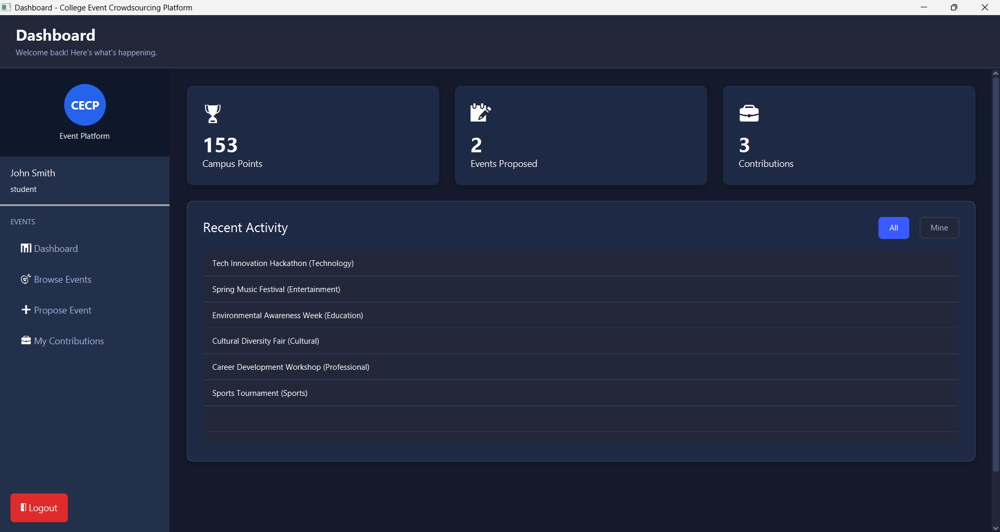

# College Event Crowdsourcing Platform

A comprehensive JavaFX desktop application that enables students, faculty, and clubs to collaboratively propose, vote, and fund college events. The system includes gamification features, admin management, and real-time analytics.

## 🎯 Features

### Core Functionality
- **User Management**: Registration, login, role-based access (Student, Faculty, Admin)
- **Event Proposals**: Submit events with title, description, category, budget, and timeline
- **Voting System**: One vote per user per event with real-time vote counting
- **Comments & Feedback**: Interactive discussion on event proposals
- **Skill & Resource Pledging**: Users can contribute skills, resources, or funding
- **Micro-Funding Simulation**: Track funding progress and contributions
- **Admin Dashboard**: Approve/reject proposals, assign organizers, manage events
- **Event Calendar**: View upcoming events with filtering options
- **Gamification**: Campus Points system for user engagement
- **Analytics**: Charts and statistics for event categories and funding progress

### Technical Features
- **JavaFX GUI**: Modern, responsive user interface
- **MySQL Database**: Robust data persistence with JDBC
- **MVC Architecture**: Clean separation of concerns
- **Prepared Statements**: SQL injection prevention
- **Input Validation**: Comprehensive data validation
- **Real-time Updates**: Dynamic data refresh

## 🗄️ Database Schema

The application uses MySQL with the following main tables:

- **users**: User accounts with roles and points
- **events**: Event proposals with status tracking
- **votes**: User votes on events
- **comments**: Event discussions
- **contributions**: Skills, resources, and funding contributions
- **event_organizers**: Event management assignments

## Output Screenshots




## 🚀 Getting Started

### Prerequisites

- Java 17 or higher
- MySQL 8.0 or higher
- Maven 3.6 or higher

### Installation

1. **Clone the repository**
   ```bash
   git clone <repository-url>
   cd event-crowdsourcing-platform
   ```

2. **Set up MySQL Database**
   ```bash
   # Create database
   mysql -u root -p < database/schema.sql
   
   # Load sample data
   mysql -u root -p < database/sample_data.sql
   ```

3. **Configure Database Connection**
   Update the database credentials in `DatabaseManager.java`:
   ```java
   private static final String DB_URL = "jdbc:mysql://localhost:3306/college_events";
   private static final String DB_USER = "root";
   private static final String DB_PASSWORD = "your_password";
   ```

4. **Build and Run**
   ```bash
   # Build the project
   mvn clean compile
   
   # Run the application
   mvn javafx:run
   ```

### Demo Accounts

The application comes with pre-configured demo accounts:

- **Admin**: admin@college.edu / password
- **Student**: john.smith@college.edu / password  
- **Faculty**: emily.davis@college.edu / password

## 📱 User Interface

### Login & Registration
- Clean, modern login interface
- User registration with role selection
- Input validation and error handling

### Main Dashboard
- Personalized user statistics
- Recent activity feed
- Quick navigation to all features

### Event Management
- Browse events with filtering options
- Detailed event view with voting and commenting
- Event proposal submission form
- Real-time funding progress tracking

### Admin Panel
- Pending event approvals
- User management
- Analytics dashboard with charts
- Event status management

## 🎮 Gamification System

### Campus Points
Users earn points for various activities:
- **Proposing Events**: 10 points
- **Voting**: 5 points per vote
- **Commenting**: 2 points per comment
- **Contributing**: 10 points per contribution

### Leaderboards
- Top contributors by points
- Most popular event categories
- Funding progress analytics

## 🛠️ Technical Architecture

### Project Structure
```
src/main/java/com/college/eventcrowdsourcing/
├── Main.java                          # Application entry point
├── model/                            # Data models
│   ├── User.java
│   ├── Event.java
│   ├── Vote.java
│   ├── Comment.java
│   └── Contribution.java
├── controller/                       # UI controllers
│   ├── LoginController.java
│   ├── RegisterController.java
│   ├── MainDashboardController.java
│   └── EventDetailsController.java
├── database/                        # Database layer
│   └── DatabaseManager.java
└── util/                           # Utility classes

src/main/resources/fxml/            # FXML UI files
├── LoginView.fxml
├── RegisterView.fxml
├── MainDashboard.fxml
└── EventDetailsView.fxml

database/                           # Database scripts
├── schema.sql
└── sample_data.sql
```

### Key Design Patterns
- **Singleton**: Database connection management
- **MVC**: Separation of UI, business logic, and data
- **DAO**: Data access through DatabaseManager
- **Observer**: Real-time UI updates

## 🔧 Configuration

### Database Configuration
Update connection parameters in `DatabaseManager.java`:
```java
private static final String DB_URL = "jdbc:mysql://localhost:3306/college_events";
private static final String DB_USER = "your_username";
private static final String DB_PASSWORD = "your_password";
```

### Application Settings
- Default window size: 600x500 (login), maximized (dashboard)
- Database connection pooling
- Automatic connection cleanup on exit

## 📊 Analytics Features

### Event Analytics
- Category distribution (Pie Chart)
- Funding progress (Bar Chart)
- User engagement metrics
- Popular event trends

### User Analytics
- Points leaderboard
- Contribution statistics
- Activity tracking

## 🚀 Deployment

### Development
```bash
mvn clean compile
mvn javafx:run
```

### Production Build
```bash
mvn clean package
java -jar target/event-crowdsourcing-1.0.0.jar
```

## 🤝 Contributing

1. Fork the repository
2. Create a feature branch
3. Make your changes
4. Add tests if applicable
5. Submit a pull request

## 📝 License

This project is licensed under the MIT License - see the LICENSE file for details.

## 🆘 Support

For support and questions:
- Check the documentation
- Review the sample data for examples
- Examine the controller classes for implementation details

## 🔮 Future Enhancements

- Email notifications
- Mobile app integration
- Advanced analytics dashboard
- Payment integration for real funding
- Social media integration
- Event calendar synchronization
- Advanced search and filtering
- Export functionality for reports

---
**Built with JavaFX, MySQL, and Java 17**

This project is also available at: https://github.com/Vivek-the-creator/College-Event-Crowdsourcing-Platform


